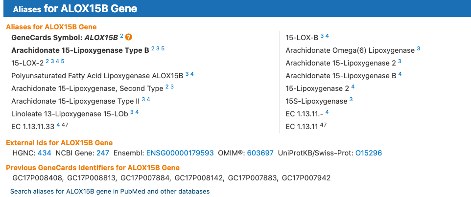

# Genomic databases

There are many databases that hold information about genes. Today, we are going to look at the most highly upregulated gene in our treated samples, *ALOX15B*, and explore what we can learn about it from genomic databases.

First, let's look at the gene on GeneCards, the human gene database:

[GeneCards link](https://www.genecards.org/cgi-bin/carddisp.pl?gene=ALOX15B)

Look at the section on the website here summarising the information about the gene. There are links to the gene on other databases, such as NCBI and Ensembl (note our gene ID in the dataset is the Ensembl ID), and there is a lot of information about the gene, including its function, expression, and interactions with other proteins in these databases. 

##### EXERCISE 🧠🏋️‍♀️ (5 mins) - GeneCards

Take a few minutes to explore the GeneCards page for *ALOX15B* and see what information you can find about the gene. What is its function? Where is it expressed? Does it interact with any other proteins? Checkout some of the links to other databases and see what information you can find there as well.*(Note: The Ensembl website is occasionally down and you may not be able to access it, but you can still explore the other databases.)*

## NCBI 

Tthe National Center for Biotechnology Information (NCBI), hosted by the National Library of Medicine (USA Government), is a comprehensive resource for genomic information. It includes a variety of databases, such as GenBank, which is a repository of nucleotide sequences, and RefSeq, which is a curated collection of reference sequences for genes and proteins. It also includes tools for sequence analysis, such as BLAST, which allows you to compare your sequence of interest to other sequences in the database to find similar sequences and identify potential functions.

##### EXERCISE 🧠🏋️‍♀️ (10 mins) - GenBank 

Let's have a look at our gene of interest, *ALOX15B*, on NCBI, specifically on the GenBank database.

[GenBank entry for ALOX15B (transcript ref seq NM_001141.3)](https://www.ncbi.nlm.nih.gov/nuccore/NM_001141.3?report=genbank&log$=seqview)

Answer these questions below:

1. How many base pairs (bp) is the mRNA sequence? 
2. How many base pairs is the coding sequence (cds)?
3. How many amino acids in the protein sequence?
4. Which exon does the cds start in?
5. There are three different codons used to encode a stop codon, these are 'TAA', 'TAG', and 'TGA'. Can you find the stop codon in the nucleotide sequence? Which one is it?

::: {.callout-tip collapse="true"}
# Answers:

1. 2697 bp
2. 2128-98(+1) = 2031 bp (we have to add 1 because both the start and end positions are included in the length of the sequence!)
3. (2031 / 3) - 1 = 676 amino acids (the cds has 2031 bp and each amino acid is coded by 3 nucleotides, so we divide the length of the cds by 3 to get the number of amino acids in the protein sequence. However, the last codon is a stop codon, which does not code for an amino acid, so we subtract 1 from the total number of amino acids to get the final count.)
4. Exon # 1 - The first exon coordinates are 1-244, and the cds starts at position 98, which is within the first exon.
5. The stop codon is 'TAA' and it is located at position 2126-2128 in the nucleotide sequence (the last three nucleotides of the cds, inclusive).
:::

### Basic Local Alignment Search Tool (BLAST) 🚀

BLAST is a powerful tool for comparing nucleotide or protein sequences to sequence databases and calculating the statistical significance of matches. It can be used to identify homologous sequences, predict the function of a gene, and find potential orthologs in other species.

As an example, let's say we have a novel sequence that we want to identify. We can use BLAST to compare our sequence to the sequences in the database and find out what it is similar to. This can help us identify the gene or protein that our sequence is most closely related to, and give us clues about its function.

Here we are going to BLAST our human *ALOX15B* protein sequence against the non-redundant protein database (nr) to see if we can find any similar sequences and learn more about our gene of interest.

1. Click on the protein ID link (NP_001132.2) on the GenBank page for *ALOX15B* to get to the protein sequence page. It is under the cds section of the GenBank entry.  
2. Click on the 'Run BLAST' button on the right side of the page to open a BLAST search for the protein sequence.  
3. On the BLAST page, change the following parameters:  
    -  Set the database to 'RefSeq protein' database. This is a curated database of reference sequences for genes and proteins, which can help us find high-quality matches to our sequence of interest.  
    - Limit the records to 'Primates (taxid:9443)', which will restrict our search to sequences from primates, including humans and other closely related species.  
4. Click the 'BLAST' button at the bottom of the page to start the search. This can take a few minutes to run, so be patient!  

The first result should be our original sequence, which is a perfect match to itself. 

You can see that:  

-  the **Query cover is 100%.** The query percentage shows how much of our original sequence (the query) is covered by the matching sequence in the database (the subject). In this case, it is 100%, which means that the entire length of our original sequence is covered by the matching sequence in the database.   
- the **E-value is 0.** This **E**xpect-value represents the number of matches we would expect to see by chance when searching a database of a particular size. An E-value of 0 indicates that the match is highly significant and is not likely to have occurred by chance.  
- the **Percentage Identity is 100%**, which means that our sequence is identical to itself, as expected. This measures the percentage of characters (nucleotides or amino acids) that match exactly between the query and subject sequences over the *aligned* region.  

Click on the link for the first result to see the details of the alignment between our original sequence and the matching sequence in the database. 

The alignment is shown as three lines of amino acid sequences: the query sequence (our original sequence), the subject sequence (the matching sequence in the database), and a line in between that shows the matches between the two sequences. In this case, since our original sequence is identical to itself, all of the amino acids match perfectly, so all three lines are identical. 

The next few results should be sequences from other primates that are very similar to our human *ALOX15B* protein sequence. You can click on the links to these sequences to learn more about them and see how they compare to our original sequence.

##### EXERCISE 🧠🏋️‍♀️ (10 mins) - BLAST

Questions:

1. What is the next closest match to our human *ALOX15B* protein sequence in the database? Which species is it from and what are the query cover and percent identical percentages? 
2. Click on the sequence description to jump to the alignment between our query and this subject. There are 670/676 Identities and 674/676 Positives. What is the difference between identities and positives in a BLAST alignment? Can you find the mismatches in the alignment and identify how these are represented?

::: {.callout-tip collapse="true"}
# Answers:

1. Pan troglodytes (chimpanzee). The query cover is 100% and the percent identical is 99.11%. This means that the entire length of our original sequence is covered by the matching sequence from the chimpanzee, and that 99.11% of the amino acids in the two sequences are identical, which indicates a very high level of similarity between the human and chimpanzee *ALOX15B* protein sequences.  
2. Identities refer to the number of positions in the alignment where the amino acids are exactly the same between the query and subject sequences. Positives refer to the number of positions where the amino acids are either identical or similar (e.g., they have similar properties such as charge or hydrophobicity). In this case, there are 670 identities, which means that 670 amino acids in the alignment are exactly the same between the human and chimpanzee sequences. There are also 674 positives, which means that there are an additional 4 positions where the amino acids are similar but not identical. The mismatches in the alignment are represented by spaces in the middle line of the BLAST output, which indicates that there is no match at those positions between the query and subject sequences. The positives are represented by '+' symbols in the middle line, which indicates that there is a match at those positions between the query and subject sequences, but the amino acids are not identical. In this case, there are 4 positions where there are '+' symbols, indicating that there are 4 amino acids that are similar but not identical between the human and chimpanzee *ALOX15B* protein sequences.

:::

