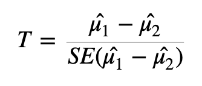

# Identify Differentially Expressed Genes 📉📈

A fundamental part of RNA-seq is identifying which genes are more highly expressed in one group of samples compared to another group of samples. This is called differential gene expression (DGE) analysis. Notice that we say we are comparing *groups* of samples, not comparing *individual* samples. In science we ***always need replicates*** -- it is not meaningful to make conclusions based on a single sample or observation. 

In order to identify which genes are differentially expressed between two groups (in this case, we have 4 samples that are in the treatment group and 4 samples in the untreated or control group), we need to test if the two groups are *significantly different* from one another, which can be a challenging question to answer. We can start by specifically asking our question as a statistical question: Are the differences we *observe* between the two groups **greater than the differences** we would *expect* to see by chance?

## Identifying DEGs using DESeq2

DESeq2 is a highly-regarded R package for analysing RNA-seq data. DESeq2 uses a [negative binomial](https://en.wikipedia.org/wiki/Negative_binomial_distribution) method to model the count data, and combines this with a generalised linear model (GLM) to identify differentially expressed genes. For more about the [DESeq2 package](https://genomebiology.biomedcentral.com/articles/10.1186/s13059-014-0550-8), you can read the original article.

In practice, a lot of the statistical tests and corrections happen 'behind the scenes' when performing DGE using software such as DESeq2.

Let's run the code and then talk about what's happening:

```{r}
#| echo: false
#| message: false
#| warning: false

library(DESeq2)
library(tidyverse)
dds <- readRDS("data/dds.rds")
```

```{r}
dds <- DESeq(dds)
```

We get a few print out messages as we run this code. What do these outputs mean? 

> An in-depth knowledge of what is happening here is not important for today, but some explanations below are provided for the curious!

**Estimating size factors:** assesses library size and calculates factors to adjust for differences between samples. This also adjusts for compositional differences (e.g., if gene X in sample 1 takes up a very large proportion of all available reads, other genes will have correspondingly fewer genes. If this effect is not uniform across samples, it can be corrected for during this stage).

**Dispersion:** adjusting for heteroscedasticity. DESeq2 makes use of variability estimates from not just one gene, but from all genes to make estimates about overall levels of variance. By bringing in (or “borrowing”) information from other genes, DESeq2 compensates for a small number of samples (which can lead to artificially small variance estimates otherwise).

**Fitting model and testing:** fitting the generalised linear model (GLM) and identifying differentially expressed genes.


::: {.callout-note appearance="minimal"}
#### Heteroscedasticity

[Heteroscedasticity](https://en.wikipedia.org/wiki/Homoscedasticity_and_heteroscedasticity) is "heterogeneity of variance". If the variance we observe is non-uniform across a range of values, we can describe the dataset as heteroscedastic. This [write-up](https://github.com/friedue/Notes/blob/master/RNA_heteroskedasticity.md) gives an in-depth explanation of heteroscedasticity in RNA-seq and how we can think about it. In RNA-seq, this means that variance depends on the mean expression of the gene. Wikipedia has a useful example:

*"A classic example of heteroscedasticity is that of income versus expenditure on meals. A wealthy person may eat inexpensive food sometimes and expensive food at other times. A poor person will almost always eat inexpensive food. Therefore, people with higher incomes exhibit greater variability in expenditures on food."* 

<iframe src="data/heteroscedasticity.html" width="100%" height="480px" style="border:none;"></iframe>


##### EXERCISE 🧠🏋️‍♀️ (3 mins)
Given the above example, do you expect genes with higher *on average* expression to have higher or lower variance than genes with lower expression? 

::: {.callout-tip appearance="minimal" collapse="true"}
## Solution
This can be a surprisingly complex question to answer, and depends on how we think about variance. If a gene has a high mean expression (*e.g.,* say 1000), then we can expect that the standard deviation will be a reasonably high number (*e.g.,* let's say 20). If a gene has low mean expression (e.g., 10), then the standard deviation will be small (*e.g.,* 2). So, it is true to say that for genes with higher average expression, the standard deviation is greater.

However, we also need to think about magnitude of variance, which we can do using the numbers from our above imaginary examples. For the gene with a mean expression of 1000 and sd of 20, going from 1000 to 1020 is not a big change (i.e., 1.02 fold change). For the gene with the low mean expression, going from 10 to 12 *is* a large change (i.e., 1.2 fold change).

Our assumption then is that a large fold change, regardless of the actual read count change for that gene, has a meaningful biological effect. 

:::

:::

#### Statistics and differential gene expression 
As you may start to be seeing, using the correct statistical assumptions, analyses and corrections are important in RNA-seq. We will not be getting in to it in any more detail, but some extra info is available for the curious:

::: {.callout-important collapse="true"}
# Extra for Experts: Background on statistics used in RNA-seq


## T-tests and p-values

The statistical approach to this question is to begin with the null hypothesis (that there is no difference between the two groups) and test whether or not you can reject the null.

To test whether or not we can reject the null hypothesis we can calculate a test statistic:



Here we are taking the difference between the means of the two groups and then dividing that difference by some measure of variability - in this case, dividing by the standard error.

If the difference in means is **LARGE** relative to the variance, the test statistic will be large (indicating significance). If the difference between the means is **small** relative to the variance, the test statistic will be small, indicating the difference is probably not significant (*i.e.,* the difference we observe is in-line with the variance we observe).


Once we have a test statistic we will calculate a p-value. The p-value is an indication of how likely we were to observe the given difference in means (or a more extreme difference) *if there is truly no difference between the means*. That is, how likely are we to see this difference due to random chance?

### Interpreting p-values

How do we interpret the p-value? We will specify a threshold (usually 0.05), and say that if a p-value is less than this threshold we will consider it a significant result. If the p-value is lower than the threshold we set, we will reject the null hypothesis (that the groups are identical) and accept the alternative (that there is a difference between the groups). The threshold we set is our level of "risk" that this event happened by chance alone.

When we declare that a result with a p-value of less than 0.05 is significant, we are saying that *we believe the difference to be true* since, if there was truly **no** difference, **such a result would happen less than 5% of the time**.

A useful mental analogy is to consider flipping a coin. We know that for a fair coin, the odds of getting heads is 50:50. Still, if we get four heads in a row it doesn't worry us - it's entirely plausible given the variation we expect. But if we get 50 heads in a row, while we know it's statistically *possible*, we know it's very unlikely to see such an extreme result. If we got to 100 heads in a row, we might instead start to question the fairness of the coin - we would reject the null hypothesis that the odds of heads and tails is identical.

### Types of errors

It's important to think about the two possible ways in which we could be wrong when testing a hypothesis like this: we could generate a false positive or a false negative.

-   A false positive or Type I error is when we *reject* the null hypothesis when there is **truly no significant difference**.

-   A false negative or Type II error is when we *fail to reject* the null hypothesis when there **truly is a significant difference**.

When we select a p-value threshold of 0.05, we are accepting the fact that 5% of the time that the null hypothesis is true, we will reject it. This becomes hugely problematic when you are testing thousands of genes! In order to avoid a large number of false positives we must correct for multiple testing. The more tests we are doing, the more stringent we need to be. We will not cover multiple testing corrections in depth but will briefly mention two types:

-   Family-wise Error Rate (FWER), also called the Bonferroni and Holm corrections, is a highly stringent procedure. This approach will give the minimal possible number of false positives, but will miss some true positives. Good if false positives are particularly costly (*e.g.,* if you are providing someone with a severe medical diagnosis).

-   False Discovery Rate control (FDR), also called the Benjamini and Hochberg correction, is less conservative than FWER. This approach will identify more significant events, but expect a greater number of false positives. Use this approach if you are more concerned about missing something valuable and can afford a few false positives.

#### **Exercise:** Note down some key features of your experiment. Are you more inclined to use FWER or FDR? Which is more appropriate for your data and your experimental situation?

### Modifying the t-test for RNA-seq

Many biological experiments struggle with getting enough samples for statistical significance. In RNA-seq experiments it is common to see groups of three samples or replicates. This is especially problematic when using the t-test (or similar procedures that involve variance). When testing for differences in gene expression it is possible to encounter genes with a small difference in the mean between the two groups and, due to the small sample size, a *very* small level of variation (a small standard error). A small difference in the means divided by a *very small* standard error translates to a large test statistic, which is then translated to a small p-value and what **looks** like a highly significant result.

Since this issue is caused by an artificially low standard error due to low sample numbers, a number of methods have proposed artificially increasing the standard error in some way. One way to implement this is through Shrinkage Estimation, which involves using Empirical Bayes methods to adjust individual test statistics based on the overall distribution of variances. During shrinkage estimation, small standard errors are made larger while large standard errors are made smaller.

:::

**TL;DR:**

DESeq2 automatically applies the corrections we need for these data. The “standard” P-value of 0.05 is not sufficient – 5% is too many genes that will be false positives (i.e., genes that look like they are DE, but they are not). We need to use a correction - usually FDR. DESeq2 automatically applies this correction. We must correct for heteroscedasticity, i.e., cases where variance is dependent on the mean, which DESeq2 also automatically does. 


### The DESeq2 object

The DESeq2 package requires a specific data storage object called a "DESeq Data Set" or DDS object. The DDS object contains not just the count data, but also the design matrix and the metadata. Once we have created the dds object, we can view the data stored within using the counts function, which we will pipe into head to only return the first 6 rows.


```{r}

counts(dds) |> head()
```

We will now create a new object, results, to store the results in. We can access those results using either the head function or the summary function, which will give us slightly different information - both are valid and useful ways of familiarising yourself with the data.

```{r}
results <- DESeq2::results(dds)

results |> head()

results |> summary()
```

The results object contains information for all genes tested. It is practical to create a new object that contains only the genes we consider differentially expressed based on the thresholds (p-value, logFC) and methods (e.g., multiple testing adjustment) that suit our situation.

We will remove any rows that have NAs in the results object, then pull out only those with an adjusted p-value less than 0.05.

```{r}
results <- na.omit(results)

# Keep all rows in the res object if the adjusted p-value < 0.05
resultsPadj <- results[results$padj <= 0.05 , ]

resultsPadjLogFC <- results[results$padj <= 0.05 & abs(results$log2FoldChange) > log2(2),]

# Get dimensions
resultsPadj |> dim()
resultsPadjLogFC |> dim()


resultsPadj |> head()
resultsPadjLogFC |> head()


```


```{r}


library(ggiraph)
library(plotly)


# Define significance thresholds
pval_threshold <- 0.05
fc_threshold <- 1  # log2 fold change threshold

# Create a data frame for plotting
plot_data <- data.frame(
  logFC = results$log2FoldChange,
  negLogPval = -log10(results$pvalue),
  adj.P.Val = results$padj,
  ID = rownames(results)  # Assuming row names are gene IDs
)

# Add a column to categorize genes
plot_data$category <- ifelse(plot_data$adj.P.Val <= pval_threshold,
                             ifelse(plot_data$logFC >= fc_threshold, "Upregulated",
                                    ifelse(plot_data$logFC <= -fc_threshold, "Downregulated", "Passes P-value cut off")),
                             "Not Significant")


# Create the ggplot object
p <- ggplot(plot_data, aes(x = logFC, y = negLogPval, color = category, text = ID)) +
  geom_point(alpha = 0.6, size = 2) +
  scale_color_manual(values = c("Upregulated" = "red", "Downregulated" = "blue", "Not Significant" = "grey20", "Passes P-value cut off" = "grey")) +
  geom_vline(xintercept = c(-fc_threshold, fc_threshold), linetype = "dashed") +
  geom_hline(yintercept = -log10(pval_threshold), linetype = "dashed") +
  labs(
    title = "Interactive Volcano Plot of Differential Gene Expression",
    subtitle = paste("Thresholds: |log2FC| >", fc_threshold, "and adjusted p-value <", pval_threshold),
    x = "log2 Fold Change",
    y = "-log10(p-value)",
    color = "Differential Expression"
  ) +
  theme_minimal() +
  theme(
    legend.position = "right",
    plot.title = element_text(hjust = 0.5, size = 16),
    plot.subtitle = element_text(hjust = 0.5, size = 12)
  )

# Convert ggplot to an interactive plotly object
interactive_plot <- ggplotly(p, tooltip = c("text", "x", "y", "color"))

# Customize hover text
interactive_plot <- interactive_plot %>% 
  layout(hoverlabel = list(bgcolor = "white"),
         hovermode = "closest")

# Display the interactive plot
interactive_plot

```

### Differentially expressed genes stored

Let's make an object to store all the information for our list of significantly differentially expressed genes. We will use a threshold of an adjusted p-value \< 0.05 and a logFC \> 1. We will return to this object later, but for now we will move on and identify differentially expressed genes using a different method.

```{r}
#| eval: false

sigGenesLimma = which(tt$adj.P.Val <= 0.05 & (abs(tt$logFC) > log2(2)))
length(sigGenesLimma)
# 1891

sigGenesLimma <- tt[sigGenesLimma, ]
```


For simplicity, we will take the list of genes identified by limma. We will save the R object, and then see in the next episode how we can derive meaningful biological information from this long list of genes.

```{r}
#| eval: false

save(sigGenesLimma, file = 'topTable.RData')
```