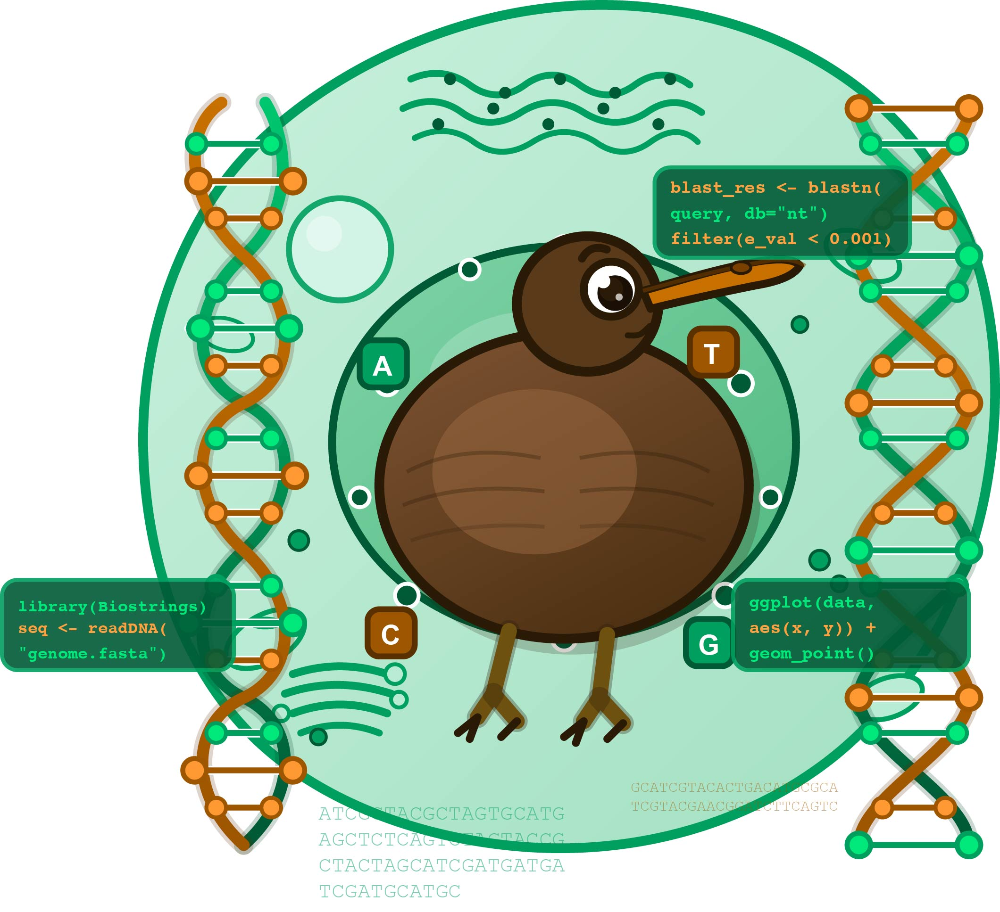
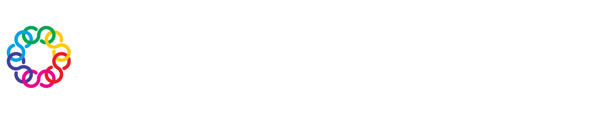

# NZIBO bioinformatics workshop 2026

{fig-align="center" width="70%"}

## Getting started with bioinformatics

This workshop was designed for the NZIBO cohort to help get you started with bioinformatic skill sets and thinking. Bioinformatics is computational skills specifically for biologists, often skills needed to analyse genomic data sets (e.g., genomes, genes, transcriptomes, and many other kinds of data sets that revolve around the nucleic acids DNA and RNA!). Therefore there are many different tools you can use. A few programming languages, such as bash and R, transcend any one particular topic and are used by almost all scientific disciplines to manipulate and investigate data. 

## What's covered in this workshop

- Introduction to the R programming language for manipulation and visualisation of data  
- Introduction to gene expression analysis using an RNA sequencing data set  
- Using the tool 'BLAST' to investigate genes of interest 

## What's NOT covered in this workshop

- Using the shell / bash programming language

## Timetable

**Monday 13th April, 2026**  

| Time     | Session                                          |
|----------|--------------------------------------------------|
| 8:30 am  | Speaker presentation by Dr Kimberley Dainty      |
| 9:00 am  | Introduction to the R programming language       |
| 9:40 am  | BREAK                                            |
| 9:55 am  | Introduction to RNAseq                           |
| 10:45 am | Digging deeper                                   |
| 10:55 am | BREAK                                            |
| 11:10 am | Identify DE genes
| 12:15 pm | LUNCH                                            |
| 1:00 pm  |                                                  |
| 3:30 pm  | END OF WORKSHOP                                  |

## Attribution

This workshop was developed by [Dr Chloé van der Burg](https://github.com/chloevdb) for the bioinformatics teaching of the NZIBO 2026 cohort. Material was re-used from the [Genomics Aotearoa Bioinformatics Training Programme](https://genomicsaotearoa.github.io/BioinformaticsTrainingProgramme/), including the Introduction to R and RNAseq data analysis workflow. 

::: {.ga-logo-block style="background: #024E7C; text-align:center; padding-top: 0.5rem; padding-bottom: 1rem; padding-left: 1.5rem; padding-right: 1.5rem; border-radius: 8px; max-width: 800px; margin: 0 auto;"}

## {.no-underline-h2 style="background: #9E5600; text-align:center;"}

[{width=80%}](https://genomicsaotearoa.github.io/BioinformaticsTrainingProgramme/)

Made with [❤️](https://docs.carpentries.org/policies/coc/) and 
[Quarto](https://genomicsaotearoa.github.io/reproducibility_with_git_and_quarto/quarto_overview.html)

:::
