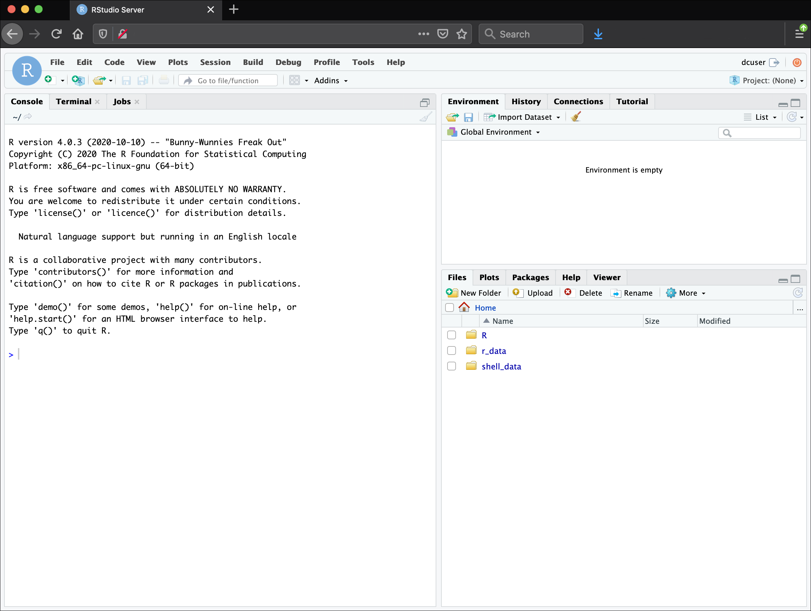
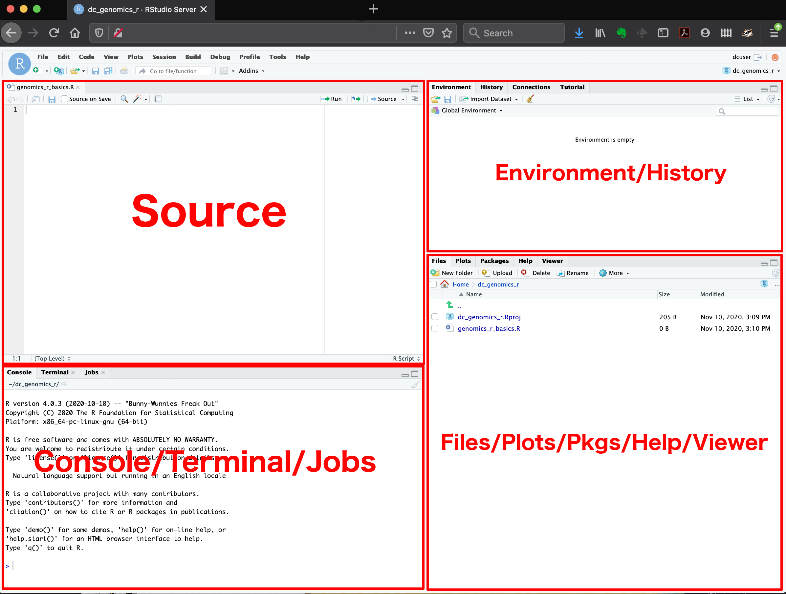
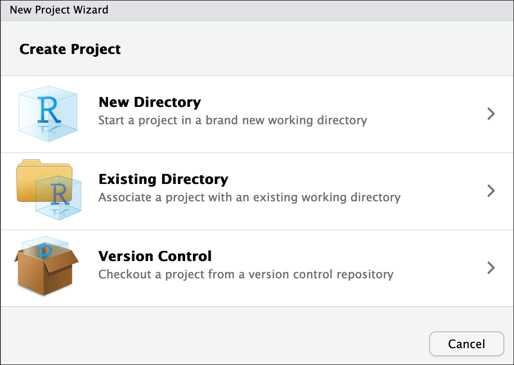
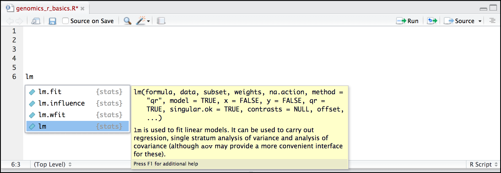
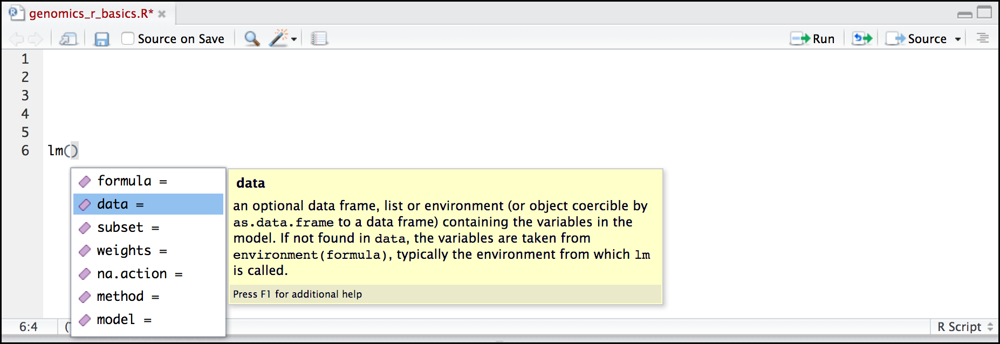

# Introducing R and RStudio


::: {.callout-caution appearance="minimal"}
## Key points

- R is a powerful, popular open-source scripting language  
- You can customise the layout of RStudio, and use the project feature to manage the files and packages used in your analysis  
- RStudio allows you to run R in an easy-to-use interface and makes it easy to find help  
:::


::: {.callout-caution appearance="minimal"}
## Objectives

- Know advantages of analysing data in R  
- Know advantages of using RStudio   
- Create an RStudio project, and know the benefits of working within a project  
- Be able to customise the RStudio layout  
- Be able to locate and change the current working directory with `getwd()` and `setwd()`   
- Compose an R script file containing comments and commands   
- Understand what an R function is   

:::


## A Brief History of R

[R](https://en.wikipedia.org/wiki/R_(programming_language)) has been around since 1995, and was created by Ross Ihaka and Robert Gentleman at the University of Auckland, New Zealand. R is based off the [S programming language](https://en.wikipedia.org/wiki/S_(programming_language)) developed at Bell Labs and was developed to teach introductory statistics. See this [slide deck](https://www.stat.auckland.ac.nz/~ihaka/downloads/Massey.pdf) by Ross Ihaka for more info on the subject.

## Advantages of using R

At more than 30 years old, R is fairly mature and [growing in popularity](https://www.tiobe.com/tiobe-index/r/). However, programming isn't a popularity contest. Here are key advantages of analysing data in
R:

-   **R is [open source](https://en.wikipedia.org/wiki/Open-source_software)**. This means R is free - an advantage that means anyone, anywhere can access it. It also means that R is actively developed by a community (see [r-project.org](https://www.r-project.org/)), and there are regular updates. 

-   **R is widely used**. Ok, maybe programming is a popularity contest. Because, R is used in many areas (not just bioinformatics), you are more likely to find help online when you need it. Chances are,almost any error message you run into, someone else has already experienced.

-  **R is powerful**. R runs on multiple platforms (Windows/MacOS/Linux). It can work with much larger datasets than popular spreadsheet programs like Microsoft Excel, and because of its scripting capabilities is far more reproducible. Also, there are thousands of available software packages for science, including genomics and other areas of life science.


## Introducing RStudio Server

In these lessons, we will be making use of a software called
[RStudio](https://www.rstudio.com/products/RStudio/), an [Integrated
Development Environment (IDE)](https://en.wikipedia.org/wiki/Integrated_development_environment).
RStudio, like most IDEs, provides a graphical interface to R, making it more user-friendly, and providing dozens of useful features. We will introduce additional benefits of using RStudio as you cover the lessons.
In this case, we are specifically using [RStudio Server](https://www.rstudio.com/products/RStudio/#Server), a version of
RStudio that can be accessed in your web browser. RStudio Server has the same features of the Desktop version of RStudio you could download as standalone software.

{width="700"}


## Overview and customisation of the RStudio layout

Here are the major windows (or panes) of the RStudio environment:




-   **Source**: This pane is where you will write/view R scripts. Some outputs (such as if you view a dataset using `View()`) will appear as a tab here.  

-   **Console/Terminal/Jobs**: This is actually where you see the
        execution of commands. This is the same display you would see if you
        were using R at the command line without RStudio. You can work
        interactively (i.e. enter R commands here), but for the most part we
        will run a script (or lines in a script) in the source pane and
        watch their execution and output here. The "Terminal" tab give you
        access to the BASH terminal (the Linux operating system, unrelated
        to R). RStudio also allows you to run jobs (analyses) in the
        background. This is useful if some analysis will take a while to
        run. You can see the status of those jobs in the background.

-   **Environment/History**: Here, RStudio will show you what datasets
        and objects (variables) you have created and which are defined in
        memory. You can also see some properties of objects/datasets such as
        their type and dimensions. The "History" tab contains a history of
        the R commands you've executed R.

-   **Files/Plots/Packages/Help/Viewer**: This multi-purpose pane will
        show you the contents of directories on your computer. You can also
        use the "Files" tab to navigate and set the working directory. The
        "Plots" tab will show the output of any plots generated. In
        "Packages" you will see what packages are actively loaded, or you
        can attach installed packages. "Help" will display help files for R
        functions and packages. "Viewer" will allow you to view local web
        content (e.g. HTML outputs).


All of the panes in RStudio have configuration options. For example, you can minimise/maximise a pane, or by moving your mouse in the space between panes you can resize as needed. The most important customisation options for pane layout are in the `View` menu. Other options such as font sizes, colors/themes, and more are in
the `Tools` menu under `Global Options`.

>Note: RStudio runs R, but R is not RStudio.

::: {.callout-important collapse="true"}
# Extra for experts - RStudio Projects

**Create an RStudio project**

One of the benefits you can take advantage of in RStudio is something called an **RStudio Project**. An RStudio project allows you to more easily:   

-   Save data, files, variables, packages, etc. related to a specific
     analysis project  
-  Use relative paths in your scripts, making your project more easily portable to other computers    
-   Restart work where you left off  
-   Collaborate, especially if you are using version control such as
    [git](http://swcarpentry.github.io/git-novice/)  


1.  To create a project, go to the **File** menu, and click **New Project**
    
{width="60%"}
    
    
2.  In the window that opens select either **Existing Directory**, if you already have a folder you want to use, or select **New Directory** if you want to make a new folder now and associate it with an R project. If you select **Existing Directory**, then select **Browse...**  and then choose and click your folder on your computer.
    
3.  Finally click **Create Project**. In the "Files" tab of your output pane (more about the RStudio layout above),   you should see an RStudio project file, `name-of-folder.Rproj`. All RStudio projects end with the `.Rproj` file extension.

>Handy tip! Name your folders on your computer without spaces -- use hyphens or underscores instead. Many programming languages do not like spaces in the names of files or folders, so you will save yourself a lot of headaches by avoiding spaces from the start. 

\

:::


## Creating your first R script

Now that we are ready to start exploring R, we will want to keep a
record of the commands we are using. To do this we can create an R
script:

1. Click the **File** menu and select **New File** and then **R Script**. 
1. Before we go any further, save your script by clicking the save/disk icon 
   that is in the bar above the first line in the script editor, or click the 
   **File** menu and select **Save**. 
1. In the **Save File** window that opens, name your file `bioinformatics-day`. 
   The new script `bioinformatics-day.R` should appear under **Files** in the 
   output pane. By convention, R scripts end with the file extension `.R`.

>You can open `.R` files in any text editor program, like Notepad.  

## Getting to work with R: Navigating directories

Now that we have covered the more aesthetic aspects of RStudio, we can
get to work using some commands. We will write, execute, and save the
commands we learn in our `bioinformatics-day.R` script that is loaded
in the Source pane. First, lets see what directory we are in. To do so,
type the following command into the script:


```{r}
#| eval: false

getwd()
```

To execute this command, make sure your cursor is on the same line the command is written. Then click the `Run` button that is just above the first line of your script in the header of
the Source pane.

In the console, we expect to see an output similar to this:

```
[1] "/Users/username"

```


Since we will be learning several commands, we may already want to keep
some short notes in our script to explain the purpose of the command.
Entering a `#` before any line in an R script turns that line into a
comment, which R will not try to interpret as code. Edit your script to
include a comment on the purpose of commands you are learning, e.g.:


```{r}
# this command shows the current working directory getwd()
```


For the purposes of this exercise we want you to be in the directory
`"/home/shared/<USERID>/R4Genomics"`. What if you weren't? You can set your home
directory using the `setwd()` command. Enter this command in your
script, but ***don't run*** this yet.


 ```r
 # This sets the working directory
 setwd()
 ```

You may have guessed, you need to tell the `setwd()` command what directory you 
want to set as your working directory. To do so, inside of the parentheses, open
a set of quotes `""`. Inside the quotes enter a `/` which is the root directory for 
Linux. Next, use the `Tab` key, to take advantage of RStudio's 
tab-autocompletion method, to select `home`, `shared`, your `<USERID>` and 
`R4Genomics` directory. The path in your script should look like this:

!!! r-project

    ```r
    # This sets the working directory 
    setwd("/home/shared/<USERID>/R4Genomics")
    ```

When you run this command, the console repeats the command, but gives
you no output. Instead, you see the blank R prompt: `>`.
Congratulations! Although it seems small, knowing what your working
directory is and being able to set your working directory is the first
step to analyzing your data.


## Using functions in R, without needing to master them

A function in R (or any computing language) is a short program that
takes some input and returns some output. Functions may seem like an
advanced topic (and they are), but you have already used at least one
function in R. `getwd()` is a function! The next sections will help you
understand what is happening in any R script.

::: {.callout-tip appearance="minimal"}
# Exercise 🧠🏋️ -- What do these functions do? 

Try the following functions by writing them in your script. See if you can guess what they do, and make sure to add comments to your script about your assumed purpose.  
    
* `dir()`
* `sessionInfo()`
* `date()`
* `Sys.time()`
* `.libPaths()`

:::

::: {.callout-tip appearance="minimal" collapse="true"}
# Solution

-   `dir()` lists files in the working directory  
-   `sessionInfo()` gives the version of R and additional info including on attached packages  
-   `date()` gives the current date  
-   `Sys.time()` gives the current time  
-   `.libPaths()` shows what libraries are available  
        
**Notice**: Commands are case sensitive! 
:::
   


You have hopefully noticed a pattern: an R function has three key
properties:

* Functions have a name (e.g. `dir`, `getwd`); note that functions are case 
  sensitive!
* Following the name, functions have a pair of `()`
* Inside the parentheses, a function may take 0 or more arguments

An argument may be a specific input for your function and/or may modify
the function's behavior. For example the function `round()` will round a
number with a decimal:

```{r}
# This will round a number to the nearest integer
   
round(3.14159)
```


## Libraries, packages, functions
Functions, like the two we have just used `getwd()` and `round()`, come from packages, which you can download to your computer then load into R as a library. Some packages are automatically installed as part of base R when you download R and Rstudio -- the two functions above are examples that come from `{base}`.
As we go along today we will discuss more on where to look for the libraries and packages that contain functions you want to use. For now, be aware that two important ones are: 

* [CRAN](https://cran.r-project.org/), the main repository for R
* [Bioconductor](http://bioconductor.org/), a popular repository for 
  bioinformatics-related R packages.

These repositories store many packages that have been developed by the R community and can be browsed and downloaded by anyone. 

## RStudio contextual help


Here is one last bonus we will mention about RStudio. It's difficult to
remember all of the arguments and definitions associated with a given
function. When you start typing the name of a function and hit the
<kbd>Tab</kbd> key, RStudio will display functions and
associated help:



You can see that the "linear model" function `lm()` comes from a package called `{stats}`, which like `{base}` also comes by default with R. 


Once you type a function, hitting the <kbd>Tab</kbd> inside the parentheses will
show you the function's arguments and provide additional help for each of these 
arguments.



## Important R things to know

We don't have time to learn everything there is to know about R -- in fact, people who have been using R for 20+ years still learn new things all the time! But, there a couple of key things about how R works that you should know now before we move on to the next section. We'll be learning more R things a long the way as we learn gene expression.   

#### **Objects** and **assignment**

To work with data in R we need to make **objects**, which we **assign** a value. 

**To create an object, you need:**

-   A name (e.g. `a`)
-   A value (e.g. `1`)
-   The assignment operator (`<-`)

In your script, use the R assignment operator `<-` to assign `1` to the object `a` as shown. Remember to leave
a comment in the line above (using the `#`) to explain what you are doing:


```{r}
# This line creates the object 'a' and assigns it the value '1'
    
a <- 1
```

Next, run this line of code in your script. You can run a line of code
by hitting the `Run` button that is above the first line of your
script in the header of the 'Source' pane or you can use the appropriate shortcut:

- Windows execution shortcut: <kbd>Ctrl</kbd> + <kbd>Enter</kbd>
- Mac execution shortcut: <kbd>Cmd(⌘)</kbd> + <kbd>Enter</kbd>

To run multiple lines of code, highlight all the line you wish to run
and then hit Run or use the shortcut key combo listed above.
In the RStudio 'Console', you should see:

```{r}
#| eval: false

a <- 1
>
```

The 'Console' will display lines of code run from a script and any outputs orstatus/warning/error messages (usually in red).
The `>` indicates R is waiting for an instruction again from you. Often when your code works, there will be no obvious output. If it didn't you will usually get an error message.

In the 'Environment' window you will also get a table:

| Values |     |
| ------ | --- |
| a      | 1   |

The 'Environment' window allows you to keep track of the objects you have
created in R.


#### Mathematical operations

R was originally designed for statistics and as such is a very powerful calculator. Most of the usual mathematical operators work as you may expect. Let's try a few.

Pure math works in R with literal numbers, for example:
```{r}
(1 + (5 ** 0.5)) / 2
```

The `**` operator is a way to write "to the power of". Other operators such as subtract `-` and multiply `*` all work too. 

Next, let's do some maths with objects. Much like algebra, objects can be part of mathematical equations. Create an object that has the value of number of pairs of human chromosomes as follows:

```{r}

hum_chr_num <- 23
```

Now, see what happens if you want to find the number of chromosomes in a diploid human cell. You can times the object by 2 to get the result:

```{r}
hum_chr_num * 2
```

Note that this output 46 is not stored anywhere, and the object `hum_chr_num` is not changed in any way. The only way to save or change an object is to **assign** a new value to it.

If we wanted to store the 46 value somewhere, we can create a new object, with our new value:

```{r}
hum_diploid_chr_num <- hum_chr_num * 2
```

Lastly, we can even do math with multiple objects, such as follows:

```{r}
hum_diploid_chr_num / hum_chr_num
```
