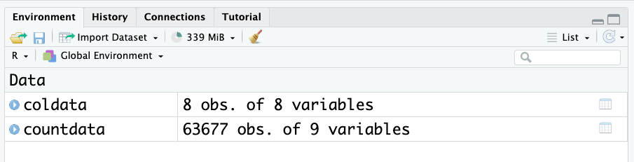
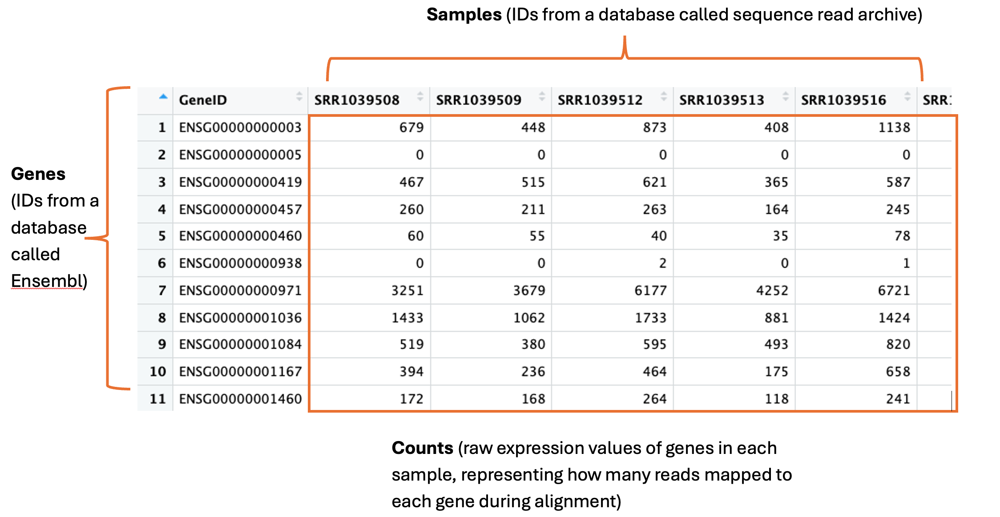
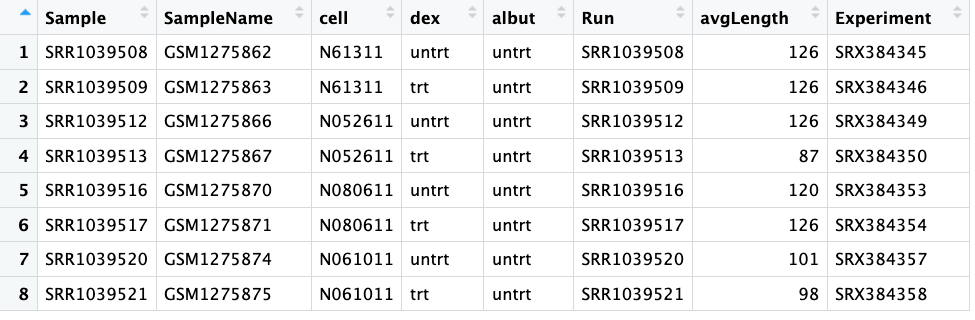

# Introduction to RNA sequencing 🧬💻

::: {.callout-caution appearance="minimal"}
## Key points 🔑

- RNA-seq captures a snapshot of gene expression across all genes at a given time, making it useful for understanding cellular processes  
- The two main data objects are **countdata** (raw gene expression counts per gene per sample) and **coldata** (metadata about the samples and experiment)  
- Raw count data often needs cleaning — removing zero-count genes and log-transforming — before it can be meaningfully visualised  

:::


::: {.callout-caution appearance="minimal"}
## Objectives 🎯

- Describe what RNA-seq is and what kind of biological questions it can answer   
- Load and inspect a dataframe in R using `read.csv()`, `head()`, and `class()`  
- Understand the structure of count data and metadata in an RNA-seq experiment  
- Install and load R packages using `install.packages()` and `library()`  
- Create and interpret boxplots using `ggplot()` from the tidyverse  

:::

RNA sequencing (RNA-seq) is the process of sequencing the nucleic acid RNA. There are a few types of RNA, but the main one that we will talk about today is mRNA -- messenger RNA -- and is generally the molecule people mean when they refer to RNAseq. mRNA is the messenger molecule in the cell that encodes a *transcript* of a gene, which is then *translated* into a protein by ribosomes in the cell. Proteins have an extremely diverse array of tasks that they perform in the cell and the body -- we won't get into it here, but suffice to say all functions in your body depend on proteins! 

RNAseq is a relatively quick and inexpensive method for capturing a snapshot of all the genes that are being expressed at any particular time in a specific tissue or location. This makes it a fantastic and versatile technology for understanding gene expression dynamics and infer what sort of cellular processes are happening at a given time, in a given tissue or under a given stimulus. 


## Our example RNA-seq dataset 

The data used in this workflow is an RNA-seq experiment of **airway smooth muscle cells treated with dexamethasone**, a synthetic glucocorticoid steroid with anti-inflammatory effects. Glucocorticoids are used, for example, in asthma patients to prevent or reduce inflammation of the airways. In the experiment, four primary human airway smooth muscle cell lines were treated with 1 micromolar dexamethasone for 18 hours. For each of the four cell lines, we have a treated and an untreated sample. 

The reference for the experiment is:

*Himes BE, Jiang X, Wagner P, Hu R, Wang Q, Klanderman B, Whitaker RM, Duan Q, Lasky-Su J, Nikolos C, Jester W, Johnson M, Panettieri R Jr, Tantisira KG, Weiss ST, Lu Q. “RNA-Seq Transcriptome Profiling Identifies CRISPLD2 as a Glucocorticoid Responsive Gene that Modulates Cytokine Function in Airway Smooth Muscle Cells.” PLoS One. 2014 Jun 13;9(6):e99625. PMID: 24926665. GEO: GSE52778.*

[Source: Bioconductor course materials; 6. RNA-Seq Differential Expression; Martin Morgan](https://www.bioconductor.org/help/course-materials/2015/Uruguay2015/V6-RNASeq.html)

#### Discussion 🧐

Based on this description, what sort of questions do you think you might want to answer with gene expression analysis of this dataset?

::: {.callout-tip collapse="true"}
# SOLUTIONS

1. Are there gene expression differences in the response of the cells to dexamethasone compared to the untreated control samples?
2. Are any of the cell lines 'better' at responding to dexamethasone than the other cell lines?
3. Can the gene expression tell us if this might be a suitable drug to treat asthma?
4. Any others you can think of? 

:::

## Exploring our data 🔎

We have prepared some files for you, which are in an open repository online. 

Let's load them in to our RStudio and orientate ourselves to the data. 

We'll first load in some metadata about our RNA-seq experiment from a csv file or "comma-separated values", which is a common way to save data from excel in a programming language friendly way.  


```{r}
coldata <- read.csv("data/coldata.csv")
head(coldata) # this head function shows the first 6 lines of an object. 

```


This coldata object we have made is called a *dataframe* which is like the R version of a table or spreadsheet in excel. 

You can confirm this using the function `class()`:
```{r}
class(coldata)
```

Next let's load in some count data. 

```{r}
countdata <- read.csv("data/count.data.csv")
head(countdata) 
```

Look at the environment panel. How many rows and columns are there for the coldata and countdata objects? (Observations = rows. Variables = columns.)




There are over 60,000 rows for count data! This is common when working with genetic datasets to have a lot of rows. Hence, its alwaysa good idead to use the `head()` function to look at these dataframes, as they are too big to view otherwise. 

In saying that, RStudio has a very nice viewing feature for dataframes. Click on the object name in the environment to open the table viewer. 

These two objects are all we need to start exploring gene expression.

### Count data

The countdata is our raw gene expression data. Here is an annotated snapshot of the dataframe: 



- In the first column are our **genes**. Genes have a descriptive gene name, but they can also be represented by a few different IDs, depending on which database they are held in or how the genome was annotated. Often you will need to cross reference IDs to find the one you want to use. For example, here are the full names for three genes: *actin beta*, *homeobox A1* and *Sex-determining region Y*, which can be represented by their gene symbols *actb*, *HOXA1* and *SRY*, and also represented by the following ensembl IDs: ENSG00000075624, ENSG00000105991, ENSG00000184895. 

- The column names are our **samples**. These can have any name the researcher decides to use. These particular samples were downloaded from the Sequence Read Archive (SRA), which is a database many researchers use to store their data for sharing upon publication of their study. Hence here the sample names are IDs designated by the SRA -- we can use the metadata to find out more info about these samples.   

- The numeric values in the table are the **counts**. This is the unprocessed, raw expression data for our genes. A single count corresponds to 1 sequence read mapping to that gene in the genome during a process called alignment. This is the initial step in RNA-seq, where the sequence read data are first 'aligned' to the genome using high performance computing. These counts are one of the main outputs from this process and what most researchers then go on to use for all downstream analyses. 

### Col data

Short for column data, this is all our metadata, or information, about our samples and experiment.

Here is a screenshot showing the whole coldata table:



- The first column shows our **'Sample'**, which you can see match the column names in our countdata.
- The columns **'SampleName'**, **'Run'** and **'Experiment'** all also show different IDs that match information in databases. We won't need to use any of these today. We also don't need the **'avgLength'** column today.  
- The third column **'Cell'** tells us the ID of the cell line -- this is some data we might need to use later.  
- The fourth column **'dex'** tells us if the samples were treated or untreated with dexamethasone -- also some useful information we'll need. Compare the values to the **'Cell'** column, does it tell you something important about the experimental design?  
- The fifth column **'albut'** indicates all samples were untreated. What do you think this means?  


::: {.callout-tip collapse="true"}
# Solutions:

- We can see that there are four unique cell lines used in this experiment, and for each cell line, there was one untreated and one dexamethasone treated sample. This is an important part of robust experimental design -- each cell line could respond differently so you need to control for this by testing every condition on all cell lines. 

- We can guess based on context that **'albut'** is probably another drug, and here all samples are untreated. If you read the paper (citation earlier), you will see they mention the drug albuterol, which has previously been used in studies to test cell responses, and a quick google search will tell you it is a commonly prescribed drug for asthma. 

:::

## Visualising our dataset 📊

The first steps in exploratory analysis of gene expression is playing around with visualising the data. You are attempting to get a sense of what the data looks like, to notice outliers or issues (e.g., hey isn’t it weird that one of my untreated samples groups with all the treated samples? I wonder what’s happening there?).

If your data set was a physical problem (like a squeaky wheel or a well wrapped present) you’d physically explore it (pick it up, is it heavy, do I shake it?). Exploratory analysis is the data science equivalent.

The first to help with our future data analysis, is to rename the column names for the samples.


```{r}
names(countdata)[2:9] <- c("S1-Un", "S2-Tr","S3-Un", "S4-Tr","S5-Un", "S6-Tr","S7-Un", "S8-Tr")
head(countdata)
```


The next thing we will do is create some boxplots. There is a great function in R called `ggplot()` that we will use. `ggplot` comes from a package called tidyverse that you will need to install by running this code:

```{r}
#| eval: false

install.packages("tidyverse")

```

Then, we need to load the package into our RStudio using the function `library()`. You only need to install a package once (well, until there are new updates to install), but every time you start up your RStudio you'll need to run `library()` again. It's a bit like if the software was a book, and your computer is your bookshelf. Once you install the software or 'book', it's sitting on your computer or 'bookshelf'. But if you want to use the software (read the book), you need to go to the bookshelf, pick up the book and open it -- i.e., run the code `library()` 

```{r}

library(tidyverse)

```


First we will convert the counts to a 'long' format. Don't worry too much about how this code is working. What is happening is we are making a new dataframe caled counts_long, which are in a format that ggplot prefers. The data itself has not changed, it has simply re-arranged. 
```{r}
# Convert counts data to long format for ggplot
counts_long <- countdata %>%
  pivot_longer(cols = -GeneID, names_to = "Sample", values_to = "Counts")
```

Now we can make a boxplot using ggplot. Again don't worry too much about how this code is working, but we'll explain it a little. ggplot graphics are built step-by-step by adding new elements with the "+" symbol. Adding layers in this fashion allows for extensive flexibility and customisation of plots, and more equally important the readability of the code. The first line of code is important - the object with the data is specified first, then the x and y aesthetics are mapped. Each line after the first builds up the plot in layers, and the next important line of code is the geom. There are many many geoms, corresponding to any plot or graph you can think of. Here we will use a boxplot. 

```{r}
# Create boxplot with ggplot2
ggplot(data = counts_long, mapping = aes(x = Sample, y = Counts)) +
  geom_boxplot() +
  labs(x = "Samples", y = "Counts") +
  theme_minimal()
```

What do you think of these boxplots? What are they telling you?

This figure indicates there are a lot of zero counts in our dataset. This is because when the countdata is generated, all of the organism's genes are listed in the output, even if no reads map to them. Further, the figure shows quite a big distribution of counts, from 10s to 100,000s. This indicates we may need to log the counts for visualisation purposes.  

We should first remove all genes that have an expression of zero, in every sample. 

We can check how many genes in each samples have counts of zero as follows:

```{r}
colSums(countdata == 0) # adds up how many zeros are in each column 
```

Let's remove them from our countdata using some code, which uses some neat tidyverse functions:

```{r}
countdata_nozeros <- countdata %>%
  filter(rowSums(across(-GeneID)) > 0)
```

Then remake our long counts format, make a new column with the logged counts and replot:

```{r}

counts_long <- countdata_nozeros %>%
  pivot_longer(cols = -GeneID, names_to = "Sample", values_to = "Counts") 

counts_long <- counts_long %>%
  mutate(logCounts = log2(Counts + 1))

ggplot(data = counts_long, mapping = aes(x = Sample, y = logCounts)) +
  geom_boxplot() +
  labs(x = "Samples", y = "Logged counts") +
  theme_minimal()
```

Now that looks more like real boxplots. What are the plots telling you now? 

At first glance, we can see there are still quite a few zero counts. This is normal -- before we removed only genes where there is a zero count in every sample. Some genes are very lowly expressed -- they have a count of zero in most samples, but not all, and were therefore not removed. 

The next thing we can see is that there is no obvious difference in expression levels of untreated vs treated samples. Often gene expression is more subtle than this -- we'll have to dig deeper!

```{r}
#| echo: false

saveRDS(countdata_nozeros, "data/countdata_nozeros.rds")
saveRDS(counts_long, "data/counts_long.rds")
saveRDS(coldata, "data/coldata.rds")
```